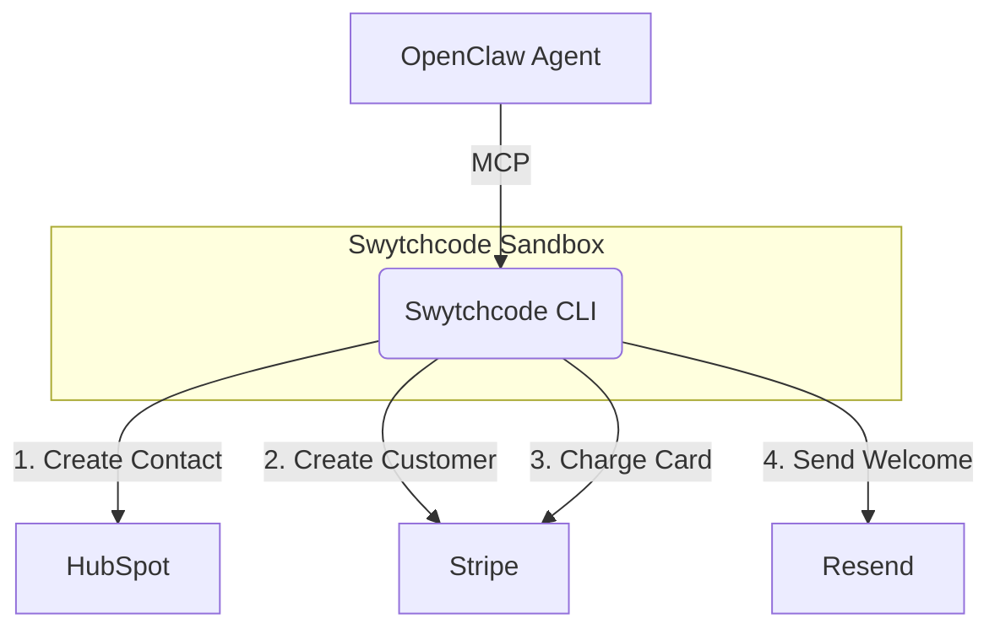

# Swytchcode Onboarding Agent Demo 🦞

[](https://swytchcode.com)
[](https://openclaw.com)

A robust, multi-API agentic workflow demonstrating secure execution using **Swytchcode** and **OpenClaw**. This repository showcases how to chain distinct services—CRM, Billing, and Communications—into a single, deterministic run while enforcing enterprise-grade guardrails.

## 🏗️ Architecture



## ✨ Key Guardrails Demonstrated

- **Multi-API Orchestration**: Seamlessly authenticates and executes across HubSpot, Stripe, and Resend without writing custom integration code.
- **Idempotency**: Safely retries sensitive operations (like credit card charges or emails) without causing duplicate side effects.
- **Local Policy Enforcement**: Intercepts and blocks unauthorized network requests locally before they ever escape your machine.
- **Audit Trails**: Centralized, secure flight-recorder logging of all AI tool executions.

---

## 🚀 Quick Start & Setup

### 1. Prerequisites
- [Node.js](https://nodejs.org/) (v18+ recommended)
- [Swytchcode CLI](https://docs.swytchcode.com) installed globally (`npm install -g swytchcode`)

### 2. Environment Setup
Clone the repository and set up your test keys:
```bash
git clone https://github.com/swytchcodehq/swytchcode-examples.git
cd swytchcode-examples/swytchcode-refund-agent-openclaw
cp .env.example .env
```

Open `.env` in your code editor and fill in your test credentials:
- **`STRIPE_SECRET_KEY`**: Your Stripe Test Mode Secret Key (starts with `sk_test_...`).
- **`HUBSPOT_PRIVATE_APP_TOKEN`**: A Private App Token from HubSpot (starts with `pat-...`).
- **`RESEND_API_KEY`**: A test API Key from Resend (starts with `re_...`).
- **`DEMO_LEAD_EMAIL`**: **Crucial:** Set this to your own personal email address. Resend's free tier requires you to send test emails to your verified address.

---

## 💻 Step-by-Step Usage Guide

### 🏃‍♂️ Demo 1: Run the Full Workflow
This script executes the full onboarding chain: creates a contact in HubSpot, creates a customer in Stripe, charges their card $20, and sends a welcome email via Resend.

**Command:**
```bash
node run-workflow.js
```

**Expected Result:** 
You will see 4 sequential steps print in your terminal. You can then log into your HubSpot and Stripe dashboards to see the new contact and the successful $20 charge, and check your inbox for the welcome email.

---

### 🛡️ Demo 2: Test Idempotency (Safe Retries)
AI agents often retry actions if they encounter network stutters. Swytchcode prevents double-charging by managing idempotency keys.

**Command:**
```bash
node demo-idempotency.js
```

**What to do:**
1. Run the command once. Wait a few seconds for the email to arrive.
2. Run the exact same command a **second** time.
3. Check your terminal: It will show a successful `200` response both times.
4. Check your inbox: You will only see **one** single email, proving the idempotency key successfully prevented a duplicate action.

---

### 🛑 Demo 3: Test Network Sandboxing
Swytchcode protects your system from rogue agent behavior by strictly enforcing local network policies.

**What to do:**
1. Open the `.swytchcode/tooling.json` file in this repository.
2. Locate the `permissions.network` array.
3. Delete the line containing `"api.hubapi.com"` (make sure your JSON syntax remains valid by removing the trailing comma on the line above).
4. Save the file.
5. Run the workflow script again:
   ```bash
   node run-workflow.js
   ```

**Expected Result:**
The script will instantly halt and print a red `permission_denied` error. Swytchcode intercepted the outbound request to HubSpot and blocked it locally before a single byte left your laptop.

*(Remember to add `"api.hubapi.com"` back to `tooling.json` when you are done testing!)*

---
*Built securely with [Swytchcode](https://swytchcode.com) & [OpenClaw](https://openclaw.com).*
